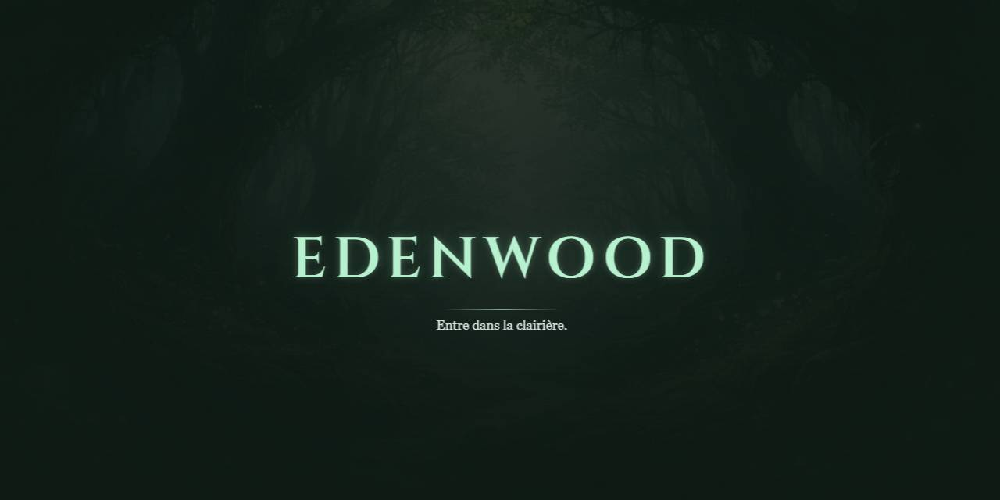

<p align="center">
  <br/>
  <a href="https://github.com/mcpronovost/edenwood">Edenwood</a> &mdash; entre dans la clairière
  <br/><br/>
</p>

<div align="center">

[](./CHANGELOG.md)
[](./LICENSE)

</div>

- **Backend:** PHP  
- **Frontend:** Vite/React

> _This project is a work in progress — but the foundation is set and contributions are welcome!_

---

## 🚀 Quick Start (Dev)

Get the project up and running locally with minimal friction (be sure to have Docker Desktop installed):

1. **Clone the repo**
   ```bash
   git clone https://github.com/mcpronovost/edenwood.git
   cd edenwood
    ```

2. **Build the containers**
   ```bash
   docker compose build
    ```

3. **Start the containers**
   ```bash
   docker compose up
    ```

4. **Run migrations inside backend container**
   ```bash
   php api/oyk/core/scripts/migrate.php
    ```

5. **Run sql statements inside database container**
   ```bash
   mysql -u DB_USER -p DB_NAME
   ```