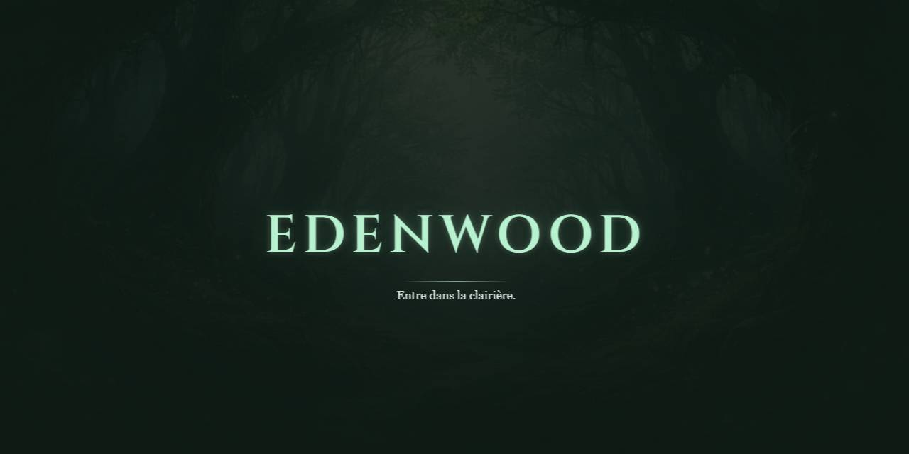

<p align="center">
  <br/>
  <a href="https://github.com/mcpronovost/edenwood">Edenwood</a> &mdash; entre dans la clairière
  <br/><br/>
</p>

<div align="center">

[](./CHANGELOG.md)
[](./LICENSE)

</div>

## 🚀 Development Server

To start the development servers for both the backend and frontend, you can use the `devserver.py` script. This script will launch both the Django backend and the Vite frontend development servers.

### Usage

1. Ensure you have the necessary virtual environment and dependencies installed for both the backend and frontend.

   Inside the root directory, run the following command to install the virtual environment:
   ```bash
   python -m venv .venv
   ```

   Inside the root directory, run the following command to activate the virtual environment:
   ```bash
   source .venv/Scripts/activate
   ```

   Inside the `edenwood/backend` directory, run the following command to install the dependencies:
   ```bash
   pip install -r requirements.txt
   ```

   Inside the `edenwood/frontend` directory, run the following command to install the dependencies:
   ```bash
   npm install
   ```

2. Run the following command to start the development servers:

   Inside the root directory, run the following command to start the development servers:
   ```bash
   python devserver.py
   ```

3. The backend server will start on port `8000`, and the frontend server will start on port `5173`.

4. To use Django management commands, you can use the following command, example to run the migrations:

   ```bash
   python devserver.py migrate
   ```

### Stopping the Servers

To stop the servers, you can use `Ctrl+C` in the terminal where the script is running. This will gracefully terminate both the backend and frontend processes.

## 📋 Code of Conduct

Please read our [Code of Conduct](CODE_OF_CONDUCT.md) to understand the standards we expect from our community.

## 🤝 Contributing

We welcome contributions!
Please see our [Contributing Guidelines](CONTRIBUTING.md) for more details on how to get involved.

## 📜 License

This project is licensed under the [BSD-3-Clause License](LICENSE).